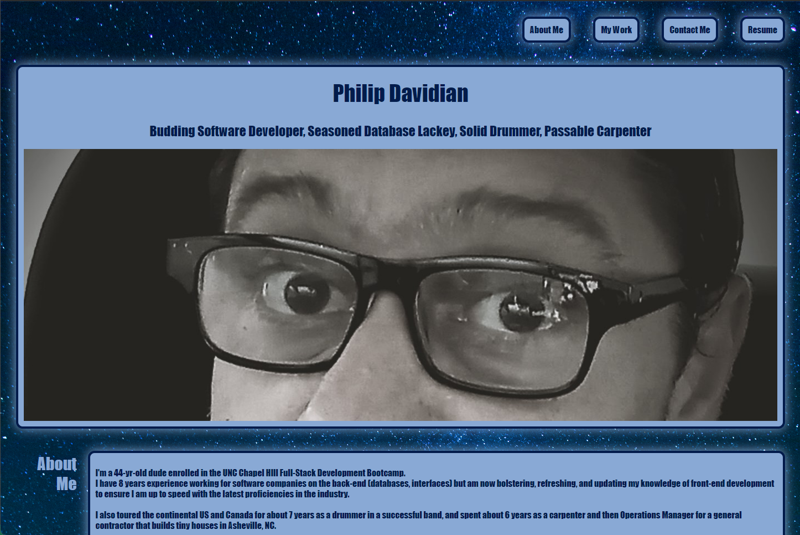
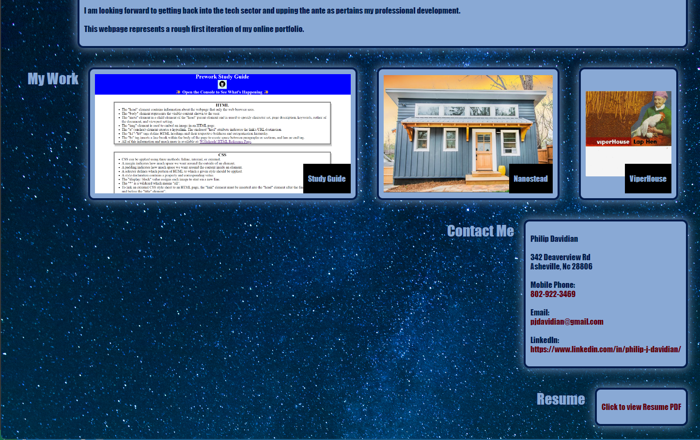

# Philip Davidian Online Portfolio

## Description

This Portfolio webpage was created as an assignment for the Coding Bootcamp at UNC Chapel Hill.
It is a work in progress, but ultimately is intended to be used as a platform to showcase my Web Development work, as well as other works and involvements that I am proud of and want to share with acquaintances and potential employers. 

In building this page, I put into practice newly attained understanding of semantic HTML, Git version control and deployment, and several CSS styling proficiencies, including Flexbox, pseudo-classes, and media queries.

## Usage

To access and load this webpage, simply visit the following URL from any contemporary web browser on your computer or mobile device:

https://peejd.github.io/Online_Portfolio/

## Preview

The following screenshots show a split preview of the webpage in a standard computer browser window:

## Credits

This page was built using HTML and CSS techniques I have been learning through the UNC Coding Bootcamp.

The background image was taken by photographer Ralph Eames and is used here with his express permission.

The Tiny House image in the work section is the intellectual property of Nanostead LLC, a general contractor in Marshall NC for which I worked and built houses such as those pictured on the linked website. This image was also used with permission from that company's owner, Jeramy Stauffer.

All other images on the site were taken or created by myself.

In the course of building this webpage, I referenced the following helpful websites for coding syntax guidance:

https://www.w3schools.com/
https://developer.mozilla.org/en-US/docs/Web
https://css-tricks.com/snippets/css/a-guide-to-flexbox/

And finally, a special thank you to Moses Nester and Daniel Ringernbach for their sage input in helping me find solutions for layout specifics for this webpage.

## License

MIT License

Copyright (c) 2023 Philip J. Davidian

Permission is hereby granted, free of charge, to any person obtaining a copy
of this software and associated documentation files (the "Software"), to deal
in the Software without restriction, including without limitation the rights
to use, copy, modify, merge, publish, distribute, sublicense, and/or sell
copies of the Software, and to permit persons to whom the Software is
furnished to do so, subject to the following conditions:

The above copyright notice and this permission notice shall be included in all
copies or substantial portions of the Software.

THE SOFTWARE IS PROVIDED "AS IS", WITHOUT WARRANTY OF ANY KIND, EXPRESS OR
IMPLIED, INCLUDING BUT NOT LIMITED TO THE WARRANTIES OF MERCHANTABILITY,
FITNESS FOR A PARTICULAR PURPOSE AND NONINFRINGEMENT. IN NO EVENT SHALL THE
AUTHORS OR COPYRIGHT HOLDERS BE LIABLE FOR ANY CLAIM, DAMAGES OR OTHER
LIABILITY, WHETHER IN AN ACTION OF CONTRACT, TORT OR OTHERWISE, ARISING FROM,
OUT OF OR IN CONNECTION WITH THE SOFTWARE OR THE USE OR OTHER DEALINGS IN THE
SOFTWARE.
